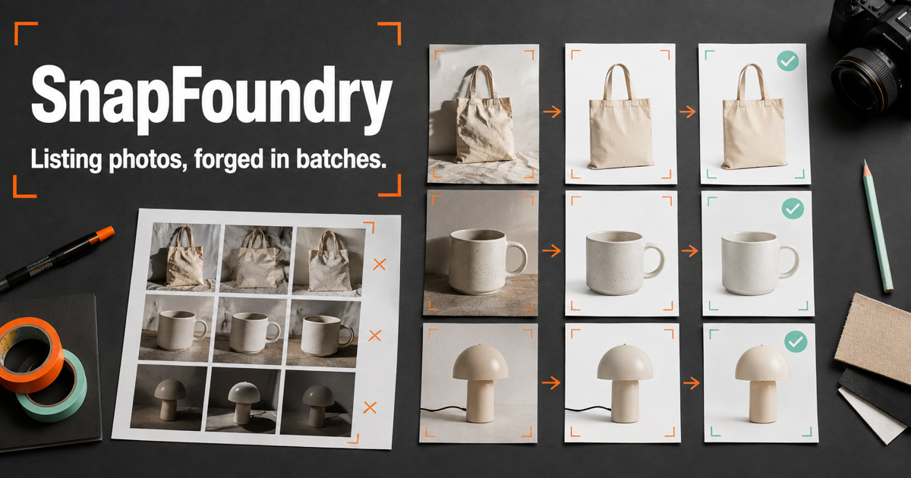

# SnapFoundry

[](https://snapfoundry.nex3sss.chatgpt.site)
[](https://github.com/Satwik-P28/snapfoundry/stargazers)
[](LICENSE)
[](https://github.com/Satwik-P28/snapfoundry/actions)

**Listing photos, forged in batches.**

SnapFoundry is a **free, private, browser-based product-photo workshop** for marketplace sellers — an open-source alternative to paid background-removal tools such as PhotoRoom. Import a local batch, remove light backgrounds deterministically, apply consistent canvas recipes, preview every result, and export a ZIP with a manifest.

[**Try the public demo**](https://snapfoundry.nex3sss.chatgpt.site) · [**Star this repo**](https://github.com/Satwik-P28/snapfoundry) · [**Run with Docker**](#docker)

No accounts, credits, or uploads. Pixels stay on your machine.



## Why this exists

Sellers should not have to pay per-image credits — or upload catalog photos to a cloud editor — just to put a product on a white square. SnapFoundry is a **local batch product-photo processor**: one recipe, many images, ZIP + CSV out.

| | Paid photo studios | **SnapFoundry** |
| --- | --- | --- |
| Price | Credits / subscription | Free, MIT, self-host |
| Uploads | Required | Never |
| Batch | Often gated | Up to 40 local images |
| Output | Vendor filenames | Predictable names + CSV manifest |
| Best on | General scenes (ML) | Products on plain light backgrounds |

The first cutout engine works best with products photographed against **plain light backgrounds**. It does not pretend to match a trained segmentation model on fur, glass, pale products, or complex scenes; those results require careful review.

## Working today

- Up to **40 local images** per batch
- Deterministic light-background removal without cloud processing
- White, transparent, mint, and coral output backgrounds
- Edge-threshold and canvas-padding controls
- Square and 4:5 marketplace ratios
- Original-versus-result review
- Batch **ZIP export** with predictable filenames and CSV manifest
- No accounts, credits, or uploads

## Quick start

Requires [Node.js](https://nodejs.org/) 22.13 or later.

```bash
git clone https://github.com/Satwik-P28/snapfoundry.git
cd snapfoundry
npm ci
npm run dev
```

Open `http://localhost:3000`. Import a batch of product photos taken on a light background.

## Docker

```bash
docker pull ghcr.io/satwik-p28/snapfoundry:latest
docker run --rm -p 3000:3000 ghcr.io/satwik-p28/snapfoundry:latest
```

Or build locally:

```bash
docker compose up --build
```

## Architecture

React 19, TypeScript, browser Canvas, JSZip, Vinext/Vite, Tailwind CSS, and shadcn components. Pixel classification and output geometry are tested with Vitest.

## Quality checks

```bash
npm run check
npm audit
```

## Contributing

If SnapFoundry saved you a credit pack — **[star the repo](https://github.com/Satwik-P28/snapfoundry)** so other sellers can find a local listing-photo workshop.

See [CONTRIBUTING.md](CONTRIBUTING.md). Cutout math belongs in tests.

### Blurb for awesome-lists

> **[SnapFoundry](https://github.com/Satwik-P28/snapfoundry)** — Private in-browser batch product-photo workshop with deterministic cutouts and ZIP/CSV export. `MIT` `Docker` `Nodejs` `Privacy`

SnapFoundry is independent and is not affiliated with PhotoRoom or any marketplace.

## License

[MIT](LICENSE)
